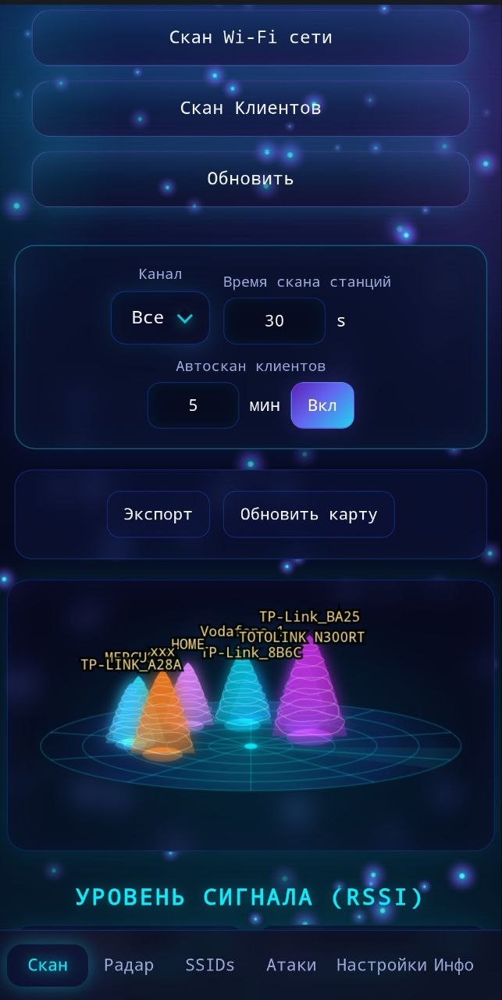
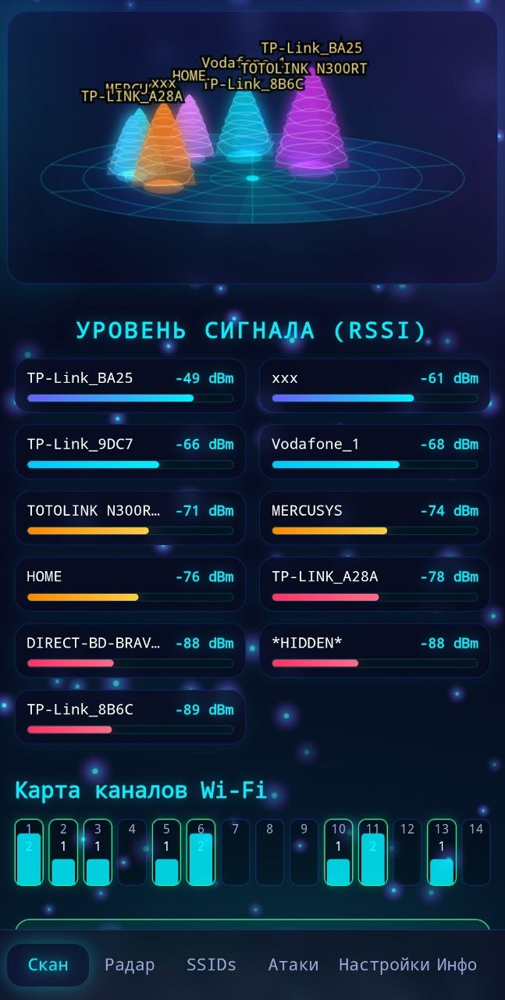
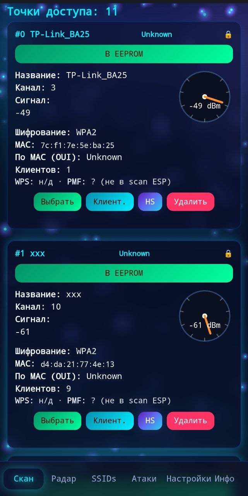
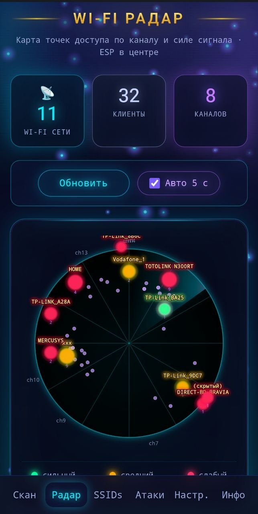
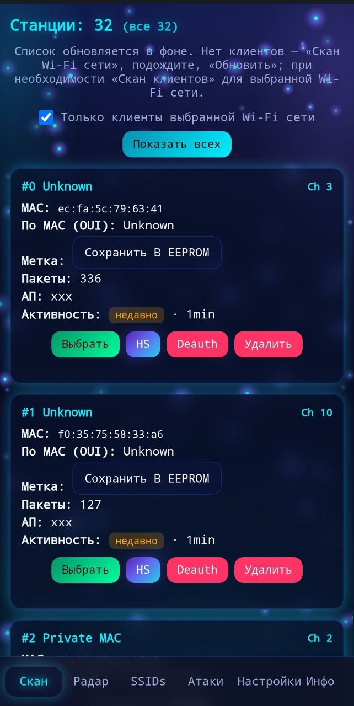
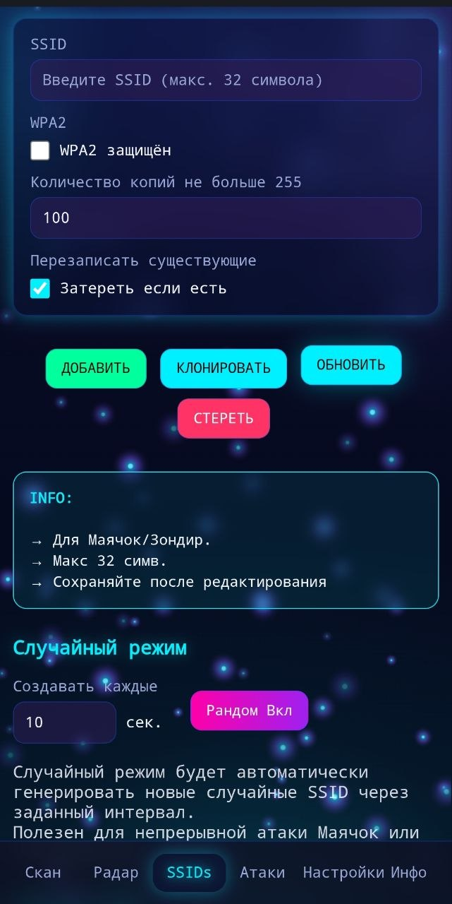
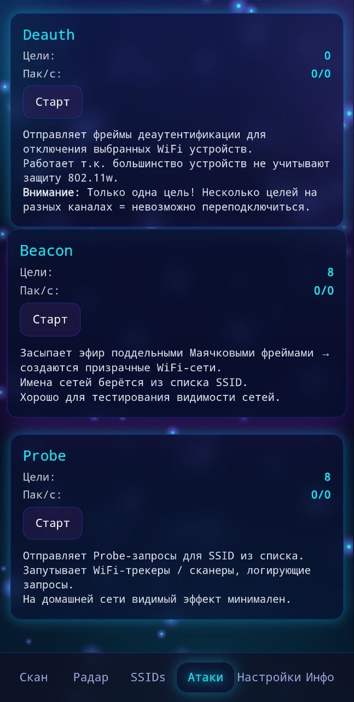

<div align="center">

# ꧁༺ 𝓒𝓲𝓬𝓪𝓭𝓪3301 ༻꧂

### ESP8266 Deauther · Web UI · Repeater

[](https://www.espressif.com/en/products/socs/esp8266)
[](/)
[](LICENSE)
[](/)

*Форк с обновлённым веб-интерфейсом, режимом ретранслятора и расширенными настройками портала.*

<br>



</div>

---

## 📋 Содержание

- [О проекте](#-о-проекте)
- [Возможности](#-возможности)
- [Скриншоты](#-скриншоты)
- [Быстрый старт](#-быстрый-старт)
- [Сборка прошивки](#-сборка-прошивки)
- [Прошивка через браузер](#-прошивка-через-браузер-webesphomeio)
- [Веб-интерфейс](#-веб-интерфейс)
- [Режим ретранслятора](#-режим-ретранслятора)
- [Структура репозитория](#-структура-репозитория)
- [Правовое предупреждение](#-правовое-предупреждение)

---

## 🦋 О проекте

**Cicada3301** — кастомная прошивка для ESP8266 (NodeMCU, Wemos D1 mini и аналоги), основанная на **ESP8266 Deauther**. Устройство создаёт точку доступа с веб-панелью для анализа Wi‑Fi окружения в учебных и легальных целях.

| | |
|---|---|
| **Платформа** | ESP8266 (802.11 b/g/n, 2.4 GHz) |
| **Прошивка** | Deauther SDK 2.7.5 |
| **Веб** | Встроенный UI (PROGMEM) или LittleFS |
| **Язык UI** | Русский (и другие `.lang`) |
| **IP по умолчанию** | `192.168.4.1` |

---

## ✨ Возможности

### Deauther (режим по умолчанию)

| Модуль | Описание |
|--------|----------|
| **Скан** | Поиск точек доступа и клиентов, RSSI, карта каналов, 3D-радар сигнала |
| **Радар** | Круговая карта AP и клиентов по каналам и силе сигнала |
| **SSIDs** | Списки имён сетей для Beacon / Probe, клонирование, случайный режим |
| **Атаки** | Deauth, Beacon, Probe (только на **своих** сетях!) |
| **Настройки** | EEPROM, MAC, канал, OTA-прошивка, Portal, режим работы |
| **Инфо** | Описание функций и предупреждение об ответственности |

### Ретранслятор (workmode = 1)

- Подключение к домашней Wi‑Fi (upstream) + раздача своей AP
- **NAPT** — интернет для клиентов ретранслятора
- **DNS-форвардер** на порту 53
- Автозапуск из `/repeater.json` после перезагрузки
- Веб-мастер настройки: выбор сети → пароль → имя AP → «Применить»

### Portal

- **Captive portal** — DNS/редиректы, окно «Вход в сеть»
- **Авторизация** — страница `/auth` с паролем
- Настройки сохраняются в `/portal_prefs.json`
- При **Captive вкл.** — разрыв Wi‑Fi при смене настроек / reboot
- При **Captive выкл.** — ожидание переподключения и автообновление страницы

### Прочее

- OTA-обновление `.bin` с проверкой маркера прошивки
- Сохранение upstream SSID в `settings.json` не перезаписывается ретранслятором
- Адаптивное меню: в режиме ретранслятора только **Ретранслятор · Настройки · Инфо**

---

## 📸 Скриншоты

### Сканирование — 3D RSSI и управление

<p align="center">
  
</p>

<p align="center"><em>Скан сетей и клиентов, канал, автоскан, 3D-радар RSSI</em></p>

---

### Сканирование — список сигналов и карта каналов

<table>
<tr>
<td width="50%" align="center">

<br><sub>RSSI по сетям · занятость каналов 1–14</sub>
</td>
<td width="50%" align="center">

<br><sub>Карточки AP: канал, шифрование, MAC, клиенты</sub>
</td>
</tr>
</table>

---

### Wi‑Fi Радар

<p align="center">
  
</p>

<p align="center"><em>Круговая карта: AP по каналу и RSSI, клиенты вокруг ESP в центре</em></p>

---

### Станции (клиенты)

<p align="center">
  
</p>

<p align="center"><em>32 станции: MAC, AP, активность, Deauth / Handshake</em></p>

---

### SSIDs и атаки

<table>
<tr>
<td width="50%" align="center">

<br><sub>Добавление SSID · клон · случайный режим</sub>
</td>
<td width="50%" align="center">

<br><sub>Deauth · Beacon · Probe</sub>
</td>
</tr>
</table>

---

## 🚀 Быстрый старт

1. **Прошейте** ESP8266 скомпилированным `.bin` — через `install.sh`, Arduino IDE или [web.esphome.io](https://web.esphome.io/) (см. раздел ниже).
2. Подключитесь к Wi‑Fi точке устройства (SSID из настроек, по умолчанию часто `cicada3301`).
3. Откройте в браузере: **`http://192.168.4.1`**
4. На заставке нажмите **«Продолжить»** → откроется скан (или ретранслятор, если включён workmode=1).

> **Пароль по умолчанию портала:** `cicada3301` (можно сменить в Настройках)

---

## 🔧 Сборка прошивки

### Требования

- [Arduino CLI](https://arduino.github.io/arduino-cli/) или Arduino IDE
- Core: **`deauther:esp8266`** (SDK 2.7.5)
- Плата: **NodeMCU 1.0 (ESP-12E / v3)** или аналог
- Схема flash: **4MB / 2OTA** (для OTA)

### Подготовка окружения (Linux / WSL)

Скрипт `setup.sh` ставит всё необходимое для компиляции:

- системные пакеты (`curl`, `python3`, `pip`, `build-essential` и др.)
- [arduino-cli](https://arduino.github.io/arduino-cli/) (если ещё не установлен)
- board package из [Spacehuhn index](https://raw.githubusercontent.com/SpacehuhnTech/arduino/main/package_spacehuhn_index.json)
- core **`deauther:esp8266@2.7.5`** и плату **`deauther:esp8266:nodemcuv2`**
- Python-пакет **`anglerfish`** (для `webConverter.py`)

```bash
cd esp8266_deauther
bash setup.sh
```

> На WSL/Ubuntu/Debian скрипт запросит `sudo` для установки пакетов. Повторный запуск безопасен — уже установленное пропускается.

### Компиляция

После `setup.sh`:

```bash
cd esp8266_deauther
bash install.sh
```

Готовый бинарник: `esp8266_deauther/bin/esp8266_deauther.ino.bin`

### Регенерация веб-интерфейса

После правок в `esp8266_deauther/web_interface/`:

```bash
python utils/web_converter/webConverter.py --repopath /path/to/esp8266_deauther_cicada3301-main
```

Скрипт обновит `esp8266_deauther/webfiles.h`.

---

## 📲 Прошивка через браузер (web.esphome.io)

Прошить NodeMCU v3 можно без Arduino IDE и esptool — через [ESPHome Web](https://web.esphome.io/) в Chrome, Edge или Firefox (нужен [Web Serial API](https://developer.mozilla.org/en-US/docs/Web/API/Web_Serial_API)).

### Что понадобится

| | |
|---|---|
| **Плата** | NodeMCU v3 (ESP8266, ESP-12E, обычно CH340) |
| **Кабель** | USB data-кабель (не только зарядка) |
| **Файл** | `esp8266_deauther/bin/esp8266_deauther.ino.bin` |
| **Браузер** | Chrome / Edge / Firefox (не Safari, не iOS) |
| **Драйвер (Windows)** | [CH340](https://www.wch-ic.com/downloads/CH341SER_EXE.html) или CP210x, если COM-порт не появляется |

### Пошагово

1. **Соберите** прошивку (`setup.sh` → `install.sh`) или возьмите готовый `.bin`.
2. **Подключите** NodeMCU v3 к компьютеру по USB.
3. Откройте **[https://web.esphome.io/](https://web.esphome.io/)**.
4. Нажмите **Connect** → выберите COM-порт платы (например `COM3` или `/dev/ttyUSB0`).
5. Выберите **Install downloaded project** (не «Prepare for first use» — это ставит ESPHome, а не Cicada3301).
6. Нажмите **Choose File** и укажите `esp8266_deauther.ino.bin`.
7. Нажмите **Install** и дождитесь окончания записи.
8. **Перезагрузите** плату (кнопка RST или отключите/подключите USB).

### После прошивки

1. В списке Wi‑Fi появится точка доступа устройства (по умолчанию часто `cicada3301`).
2. Откройте **`http://192.168.4.1`** в браузере.
3. Пароль портала по умолчанию: **`cicada3301`**.

> Сообщение вроде *«Improv Wi-Fi Serial not detected»* после прошивки — **нормально**: прошивка Cicada3301 не использует Improv, это протокол ESPHome.

### Если плата не определяется

- Проверьте USB-кабель и драйвер CH340/CP2102.
- Закройте Serial Monitor / Arduino IDE — порт должен быть свободен.
- На некоторых NodeMCU удерживайте кнопку **FLASH**, нажмите **RST**, отпустите **FLASH** (режим прошивки), затем снова **Connect** на сайте.
- На Linux добавьте пользователя в группу `dialout`:  
  `sudo usermod -aG dialout $USER` (перелогиньтесь).

---

## 🌐 Веб-интерфейс

| Страница | URL | Назначение |
|----------|-----|------------|
| Заставка | `/` / `index.html` | Splash → scan или repeater |
| Скан | `scan.html` | AP, клиенты, RSSI |
| Радар | `radar.html` | Круговая карта |
| SSIDs | `ssids.html` | Списки имён сетей |
| Атаки | `attack.html` | Deauth / Beacon / Probe |
| Настройки | `settings.html` | EEPROM, OTA, Portal, workmode |
| Ретранслятор | `repeater.html` | Мост Wi‑Fi → AP |
| Инфо | `info.html` | О проекте |

**Тема:** тёмный космический UI (`css/cicada_theme.css`), шрифты Orbitron / JetBrains Mono.

---

## 📡 Режим ретранслятора

1. **Настройки** → `workmode` → **Ретранслятор** → перезагрузка  
2. Откройте **Ретранслятор** → выберите upstream Wi‑Fi и пароль  
3. Задайте имя новой AP (например `cicada3301_relay`) → **Применить**  
4. Подключитесь к новой AP → интернет через ваш роутер  

**Статус API:**

```http
GET http://192.168.4.1/repeater/status.json
```

Пример успешного ответа:

```json
{
  "repeaterActive": true,
  "staConnected": true,
  "staSsid": "YourWiFi",
  "staIp": "192.168.31.60",
  "apSsid": "cicada3301_relay",
  "apIp": "192.168.4.1",
  "naptEnabled": true
}
```

> Роутер должен быть **2.4 GHz**. ESP8266 не работает с 5 GHz.

---

## 📁 Структура репозитория

```
esp8266_deauther_cicada3301-main/
├── Images/                    # Скриншоты для README
├── esp8266_deauther/          # Основная прошивка
│   ├── esp8266_deauther.ino
│   ├── wifi.cpp               # AP, captive, repeater, NAPT, DNS
│   ├── web_interface/         # Исходники веб-UI
│   ├── webfiles.h             # Сжатый UI (генерируется)
│   ├── setup.sh               # Подготовка окружения (arduino-cli, core, python)
│   └── install.sh             # Сборка через arduino-cli
├── utils/web_converter/       # webConverter.py
└── README.md
```

---

## ⚠️ Правовое предупреждение

> **Используйте только на своих сетях и устройствах** или с **письменного разрешения** владельца.
>
> Несанкционированное сканирование, deauth и вмешательство в чужие Wi‑Fi сети **незаконны** во многих странах.
>
> Авторы не несут ответственности за неправомерное использование. Проект предназначен для **образования** и **тестирования безопасности** собственной инфраструктуры.

---

## 🙏 Благодарности

- [SpacehuhnTech — esp8266_deauther](https://github.com/spacehuhntech/esp8266_deauther)
- [@xdavidhu — webConverter](https://github.com/spacehuhntech/esp8266_deauther/tree/master/utils/web_converter)

---

<div align="center">

**꧁༺ 𝓒𝓲𝓬𝓪𝓭𝓪3301 ༻꧂**

*Deauther · ESP8266 · Web*

</div>
